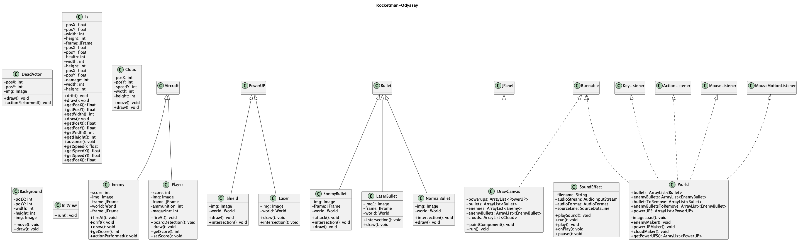
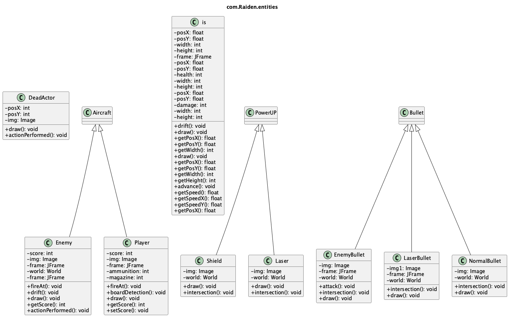
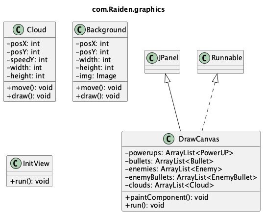
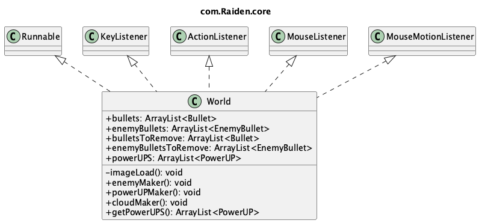
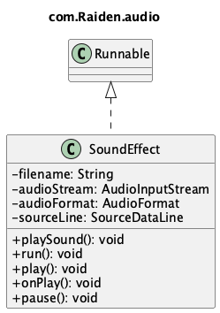

# Rocketman-Odyssey

A simple Raiden-style shoot 'em up game written in Java.

[](https://github.com/dynamicfire/Rocketman-Odyssey/blob/master/LICENSE)
[](https://github.com/dynamicfire/Rocketman-Odyssey/stargazers)
[](https://github.com/dynamicfire/Rocketman-Odyssey/issues)

> A side project from my university days (~2017). Back then I called it "a project for my Java Semester" — whatever that means.

## Screenshot


## How to Run

```bash
git clone https://github.com/dynamicfire/Rocketman-Odyssey.git
cd Rocketman-Odyssey
```

Open the project in IntelliJ IDEA (or any Java IDE), then run `InitView.java`.

> **Note:** Set JVM max heap to at least 256MB (`-Xmx256m`) or things might get choppy.

## Controls

| Key | Action |
|-----|--------|
| **F1** | Start game |
| **Space** | Pause |
| **Arrow keys** | Move |

## Project Structure

```
src/com/Raiden/
├── entities/   # Game actors (Player, Enemy, Bullet, etc.)
├── graphics/   # Rendering (DrawCanvas, Background, Cloud)
├── audio/      # Sound effects
└── core/       # Game logic (World)
```

### Class Diagram



<details>
<summary>📦 Package diagrams</summary>

| Package | Diagram |
|---------|---------|
| entities |  |
| graphics |  |
| core |  |
| audio |  |

</details>

## History

This project was originally created around 2017 when I was learning Java. 

The original code used a textbook-style `Model/View/Controller` folder structure — which didn't really fit a game project at all. The code wasn't strictly MVC either; it was just three folders named after a pattern I'd heard of. Classic student move.

In 2026, I finally got around to reorganizing it into something more sensible (`entities/graphics/audio/core`). The original MVC diagrams are preserved in [`archive/original-diagrams/`](archive/original-diagrams/) as a monument to youthful ambition.

---

### Arctic Code Vault 🏔️

This repository is part of the [GitHub Arctic Code Vault](https://archiveprogram.github.com/) — a mass of code frozen in the Arctic, preserved for 1,000 years.

Somewhere in Svalbard, on a reel of film deep inside a decommissioned coal mine, there's a copy of my messy 2017 Java code with its nonsensical MVC folders and "Java Semester" README. It will outlive me. It might outlive human civilization.

A decade feels long when you're living it. But knowing this code will sit in permafrost for a millennium puts things in perspective. We write, we learn, we move on — and somehow, the artifacts remain.

时间易逝，人生短暂。一晃快十年了。

## License

MIT
